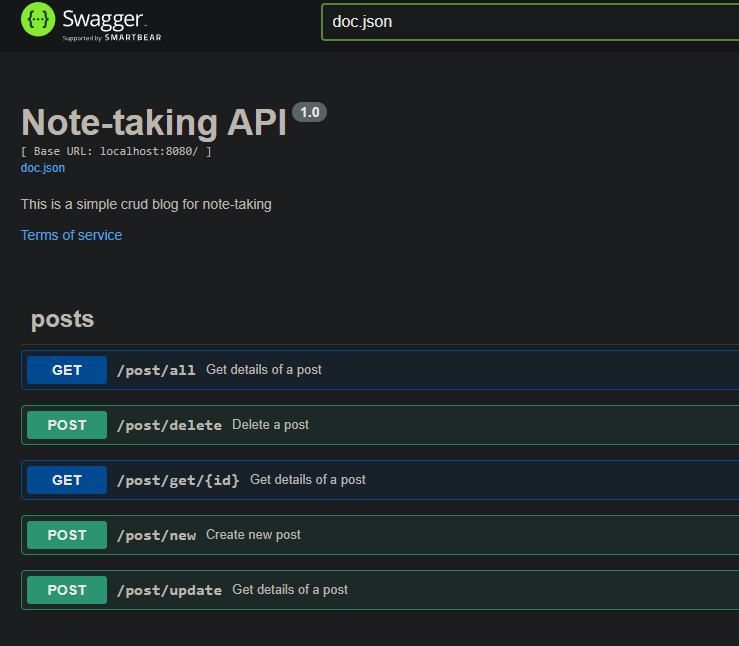

# # Simple Note-taking App 

## Example
_________________________________________________

#### Json example for create new post (via POST) :
```json
{
    "title": "web-develompent",
    "body": "THis is my first REST API in GO lang"
}
```
_________________________________________________

### Swagger docs 

to update need to run command: swag init -g cmd/main.go
